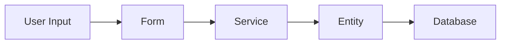
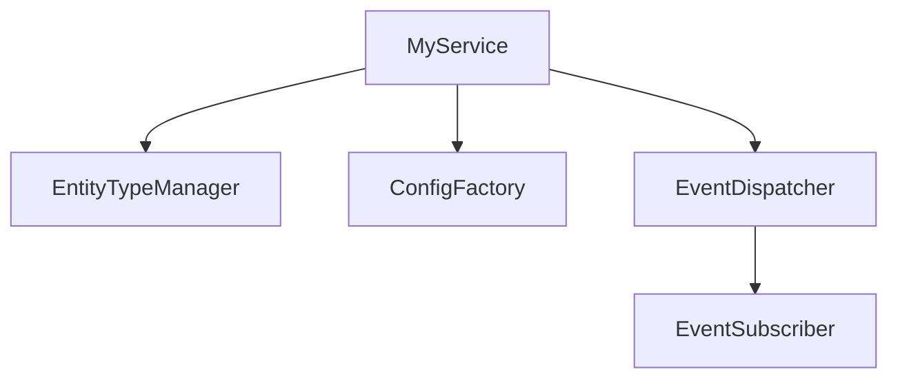
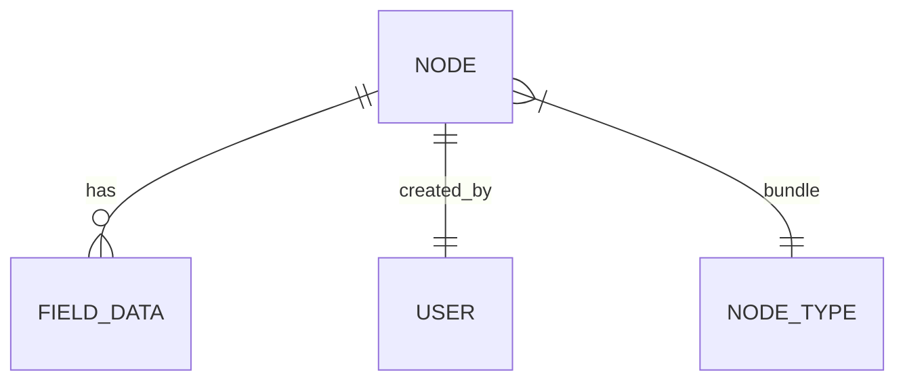
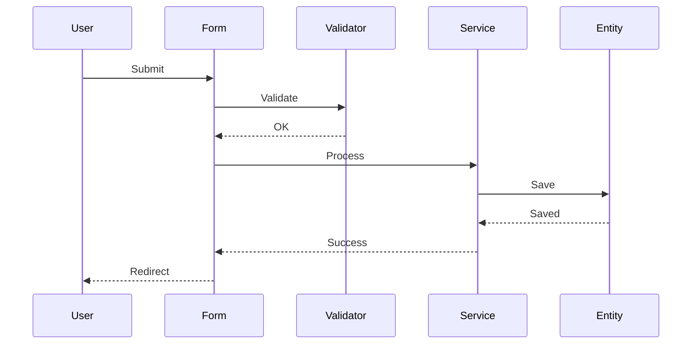
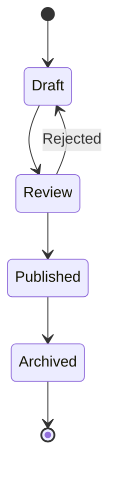

# Diagram Generator

Create Mermaid diagrams to visualize architecture and data flow.

## Triggers

- User says "Create diagram for X"
- User says "Visualize the architecture"
- Need to document component relationships
- Explaining data flow

## Diagram Types

### 1. Data Flow Diagram
Show how data moves through the system.



### 2. Service Relationship Diagram
Show dependencies between services.



### 3. Entity Relationship Diagram
Show entity structure and relationships.



### 4. Sequence Diagram
Show interaction flow over time.



### 5. State Diagram
Show entity states and transitions.



## Process

1. Understand what needs visualization
2. Choose appropriate diagram type
3. Generate Mermaid code
4. Add to architecture file
5. Offer to refine

## Output Format

Add to architecture files:

```markdown
## {Diagram Title}

{Brief description of what this shows}

\`\`\`mermaid
{diagram code}
\`\`\`

Key points:
- {point 1}
- {point 2}
```

## Best Practices

- Keep diagrams focused (one concept per diagram)
- Use clear, short labels
- Group related elements
- Include legend if using custom styling
- Add descriptive title and summary

## Human Control Points

- User specifies what to visualize
- User reviews and requests adjustments
- User approves before adding to architecture
