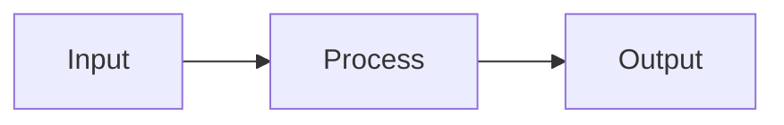
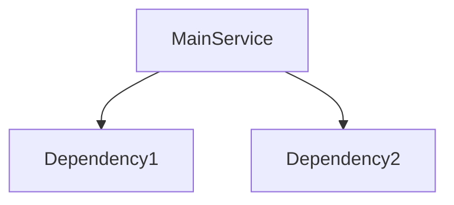
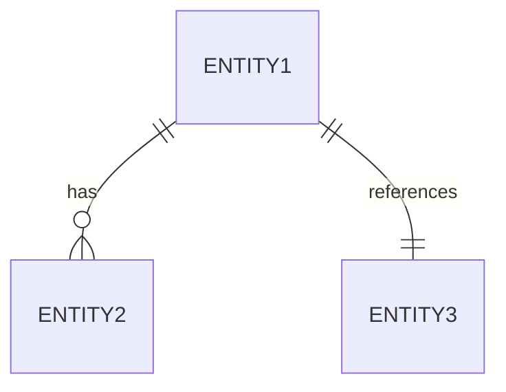
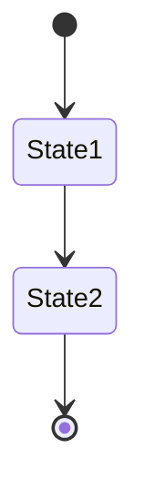
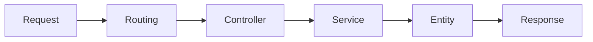
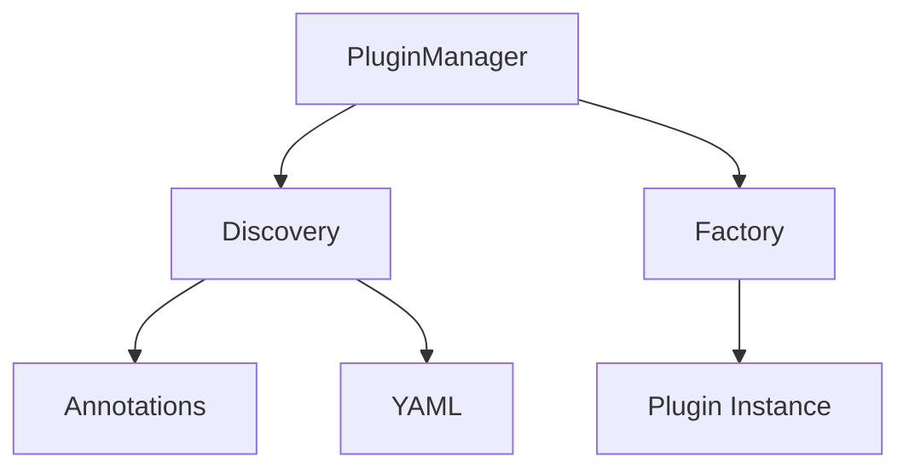
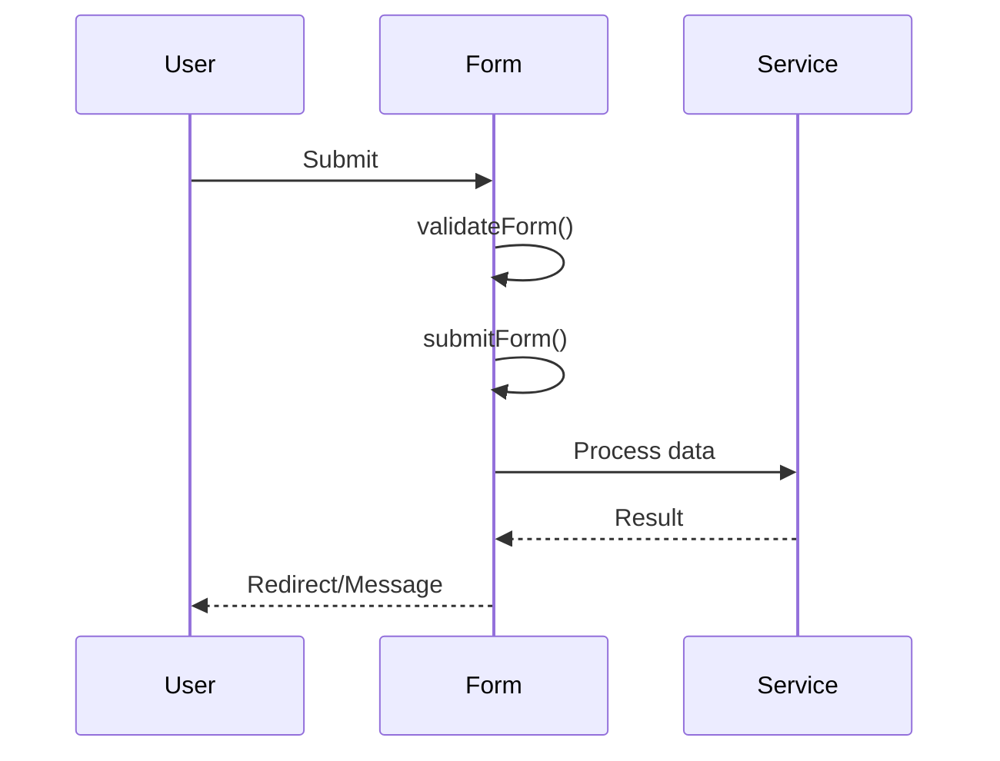

# Diagram Generator

Create Mermaid diagrams for architecture visualization.

## Activation

Activate when you detect:
- "Create diagram for X"
- "Visualize the architecture"
- "Show me the data flow"
- "Draw the entity relationships"

## Workflow

### 1. Determine Diagram Type

Ask if unclear:
```
What should this diagram show?
1. Data flow (how data moves through system)
2. Service relationships (dependencies between services)
3. Entity relationships (database structure)
4. Sequence (interaction over time)
5. State (entity lifecycle)
```

### 2. Gather Elements

Based on type, ask:

**Data Flow:**
- What is the starting point?
- What are the processing steps?
- What is the final destination?

**Service Relationships:**
- What is the main service?
- What does it depend on?
- Are there event subscribers?

**Entity Relationships:**
- What entities are involved?
- What are the relationships (one-to-many, etc.)?

### 3. Generate Diagram

Create appropriate Mermaid code:

**Data Flow:**


**Service Dependencies:**


**Entity Relationships:**


**Sequence:**
```mermaid
sequenceDiagram
    Actor->>Component: Action
    Component-->>Actor: Response
```

**State:**


### 4. Present Diagram

Show the Mermaid code to user and ask:
```
Here's the diagram:

{mermaid code block}

Adjustments needed? (describe changes or "looks good")
```

### 5. Add to Architecture

Once approved, use `Edit` tool to add to appropriate architecture file:

```markdown
## {Diagram Title}

{One sentence describing what this shows}

\`\`\`mermaid
{diagram code}
\`\`\`
```

## Diagram Templates

### Drupal Request Flow


### Plugin System


### Form Submit Flow


## Stop Points

STOP and wait for user:
- After asking diagram type
- After showing generated diagram
- Before adding to architecture file
